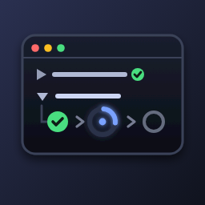

# TaskLens — Visual Task Runner for VS Code

> A clean, fast, free-forever task panel for `tasks.json`. List, run, re-run, stop, tail, favorite, and jump-to-definition for every VS Code task — Workspace, Global (User), and Auto-detected — from one activity-bar panel.

[](https://marketplace.visualstudio.com/items?itemName=pydemia.tasklens)
[](https://marketplace.visualstudio.com/items?itemName=pydemia.tasklens)
[](https://marketplace.visualstudio.com/items?itemName=pydemia.tasklens&ssr=false#review-details)
[](LICENSE)

TaskLens is a lightweight task panel for people who want quick access to VS Code tasks without extra runtime machinery: zero telemetry, no license gates, no output-buffering CPU spikes, ~200 KB bundled. It uses the **native VS Code Tasks API** (`vscode.tasks.fetchTasks()`) so it sees every task that VS Code sees — npm, gulp, grunt, typescript, and your own `tasks.json` — without re-implementing a single provider.

---

## Table of Contents

- [Why TaskLens](#why-tasklens)
- [Screenshots](#screenshots)
- [Features](#features)
- [Quick Start](#quick-start)
- [The Three Views: Workspace, Global, Auto-detected](#the-three-views-workspace-global-auto-detected)
- [Hierarchical Grouping](#hierarchical-grouping)
- [Favorites](#favorites)
- [Run, Re-run, Stop, Tail](#run-re-run-stop-tail)
- [Reveal Definition (JSONC-aware)](#reveal-definition-jsonc-aware)
- [Settings Reference](#settings-reference)
- [Commands Reference](#commands-reference)
- [Multi-root Workspaces](#multi-root-workspaces)
- [FAQ](#faq)
- [Architecture](#architecture)
- [Contributing & Development](#contributing--development)
- [License](#license)

---

## Why TaskLens

VS Code ships a `Tasks: Run Task` palette and a small auto-detected list, but neither is a navigable surface. The marketplace alternatives either re-implement every task provider from scratch (slow, brittle, license-gated) or buffer task output into custom webviews (CPU-hungry, divergent from your real terminal).

**TaskLens takes a different bet:** trust the platform.

- **Native fetch.** Tasks come from `vscode.tasks.fetchTasks()` — every contributed provider VS Code knows about is included. No npm provider to reinvent. No gulp parser to maintain.
- **Native terminal.** "Tail logs" reveals the integrated terminal VS Code already gave the task. No `OutputChannel`, no `shellIntegration`, no per-task buffer in memory.
- **Native theming.** Status icons are `ThemeIcon`s — they match your color theme automatically. No animated GIFs eating CPU.
- **Native JSONC.** Reveal-definition uses `jsonc-parser` so comments and trailing commas in `tasks.json` are first-class.

The result: a focused panel that does the eight things you actually do with tasks, and nothing else.

---

## Screenshots

> _The TaskLens panel in the activity bar — Workspace, Global, and Auto-detected views with hierarchical grouping and a Favorites pin._



---

## Features

### Three views, one panel

| View | Source | When to use |
|---|---|---|
| **Workspace** | `.vscode/tasks.json` in the open folder(s) | Tasks you wrote for this project |
| **Global** | User-level `tasks.json` (`Tasks: Open User Tasks`) | Tasks you reuse across every project |
| **Auto-detected** | Contributed by extensions (npm, gulp, typescript, …) | Tasks VS Code discovered for you |

### Hierarchical grouping

Split task labels on a configurable separator (default `::`) into nested, foldable groups. A task named `db::migrate::up` shows under `db` › `migrate` › `up`. Set the separator to `:` for legacy npm/gulp-style auto-nesting, `-` for dash-prefixed conventions, or any string you like.

### Favorites

Pin frequently-used tasks to a `★ Favorites` group at the top of each view. Per-workspace, persisted across reloads, never leaks across projects. Click the star to add; click again to remove. Favorited tasks still appear in their normal grouped location with a star indicator — favorites are quick-access, not exclusive.

### Live status

Every task row shows an icon for its current state:

| Icon | State |
|---|---|
| ⚪ idle | Not running |
| 🔵 spinner | Running |
| ✅ green check | Last run succeeded |
| ❌ red error | Last run failed |

State updates fire on `vscode.tasks.onDidStartTask` / `onDidEndTask` / `onDidEndTaskProcess` — accurate within a single event loop tick of the task changing.

### Inline & context actions

- **▶ Run** — execute the task.
- **⏹ Stop** — terminate a running task.
- **🔁 Re-run** — terminate the in-flight execution (with optional confirm), wait for it to end, then start fresh.
- **🖥 Show Terminal** — reveal the integrated terminal hosting the running task.
- **★ / ☆ Favorite** — toggle favorite state.
- **➔ Reveal Definition** — open `tasks.json` and select the matching task object (JSONC-aware).

### Auto-reload on save

Saving `tasks.json` refreshes both views. Manual `Reload Tasks` button is available in the view title bar for external edits or contributed-task changes.

### Empty-state CTAs

- No folder open? → **[Open Folder]** button.
- Folder open but no `tasks.json`? → **[Create tasks.json]** button that scaffolds a starter file with one `echo` task and the standard JSONC header.

### Multi-root aware

Workspaces with multiple folders bucket tasks by folder before grouping. Single-folder workspaces render flat. Tasks scoped to *Workspace* or *Global* go into a synthetic *Workspace* group.

### Out of scope (by design)

- **Editing tasks.** Use `tasks.json` directly — it's JSONC and VS Code's editor handles it well.
- **Debugging tasks.** VS Code's `launch.json` / F5 surface owns that.
- **Task scheduling.** Cron-style scheduling belongs in a CI tool, not your editor.

---

## Quick Start

1. **Install** TaskLens from the [VS Code Marketplace](https://marketplace.visualstudio.com/items?itemName=pydemia.tasklens) or run:
   ```
   ext install pydemia.tasklens
   ```
2. **Open** a folder that has (or could have) a `.vscode/tasks.json`.
3. **Click the TaskLens icon** in the activity bar — it appears as a stylized magnifying lens.
4. **Run a task** by clicking the ▶ button on any row, or click the row label to jump to its definition.

No configuration required. The defaults work for the vast majority of projects.

---

## The Three Views: Workspace, Global, Auto-detected

VS Code organizes tasks by *scope*, but the built-in palette mixes them all. TaskLens splits them so you can find what you need without scrolling.

**Workspace** — tasks defined in `<folder>/.vscode/tasks.json`. These are the tasks you and your teammates explicitly wrote and committed. The view shows a `[Create tasks.json]` button when this file is missing.

**Global** — tasks in your user-level `tasks.json` (`Cmd/Ctrl+Shift+P → Tasks: Open User Tasks`). Reusable across every project — perfect for "open my notes file", "rebuild dotfiles", or any per-machine workflow.

**Auto-detected** — everything VS Code's contributed providers discovered: every npm script, every gulp/grunt target, every tsc build configuration, every Makefile target (with the right extension), and so on. TaskLens delegates entirely to those providers; if a task shows up in `Tasks: Run Task` it shows up here.

The discriminator is `task.source === 'Workspace'` for the first two views; everything else is auto-detected. See [src/tree/filters.ts](src/tree/filters.ts).

---

## Hierarchical Grouping

By default, TaskLens splits each task's label on `::` to derive a tree:

```
db::migrate::up         →  db › migrate › up
db::migrate::down       →  db › migrate › down
db::seed                →  db › seed
build                   →  build       (top-level leaf)
```

Change the separator with `tasklens.groupSeparator`:

```jsonc
// .vscode/settings.json
{
  "tasklens.groupSeparator": ":"   // legacy npm/gulp-style: "npm: watch:tsc" → npm › watch › tsc
}
```

Common conventions:

| Separator | Effect | Good for |
|---|---|---|
| `::` (default) | Opt-in nesting; most existing tasks stay flat | Modern projects naming tasks like `db::migrate::up` |
| `:` | Auto-nests every npm/gulp task that uses prefixes | Repos with `npm: build`, `npm: test:unit` style names |
| `-` | Nests dash-prefixed naming conventions | `dev-build`, `dev-test`, `prod-build` style |
| `/` | Path-style hierarchy | `tools/lint`, `tools/format`, `ci/release` |

If you set the separator to an empty string, TaskLens falls back to `::`.

---

## Favorites

Favorites live at the top of each view as a synthetic `★ Favorites` group. Click the **☆ star** on any task row to pin it; the same task gets a ★ indicator wherever else it appears in the tree.

- **Storage**: per-workspace, via VS Code's `Memento` (`context.workspaceState`). Favorites survive reloads but do not leak across projects — pinning `db::migrate::up` in one repo doesn't add it to another.
- **Removal**: click the **★** (filled) on either the favorites entry or the original entry — both un-pin it.
- **Visibility**: the favorites group only renders when non-empty.

---

## Run, Re-run, Stop, Tail

### Run

Clicks `vscode.tasks.executeTask(task)` directly. The task starts in a new integrated terminal, exactly as if you'd invoked it from `Tasks: Run Task`.

### Re-run

If the task is already running, TaskLens:
1. Optionally confirms (controlled by `tasklens.confirmRerunIfRunning`, default `true`).
2. Calls `terminate()` on the live execution.
3. Waits up to 10 seconds for `onDidEndTask` to fire.
4. Calls `executeTask` for a fresh run.

If the task is not running, re-run is just run.

### Stop

Calls `terminate()` on the live `TaskExecution`. If the task isn't running anymore (race condition), shows an info message.

### Tail (Show Terminal)

VS Code already runs every task in a dedicated terminal whose name embeds the task label. TaskLens scans `vscode.window.terminals`:

1. Exact name match against `task.name`.
2. Substring match (`terminal.name.includes(task.name)`).
3. Calls `terminal.show(false)` to reveal and focus it.

If no terminal matches (the task ended, or the task uses `presentation.reveal: never`), shows an info message. **No output is captured or buffered** — your terminal is the source of truth, with full ANSI colors, scrollback, and shell integration intact.

---

## Reveal Definition (JSONC-aware)

Click any task row's label (or use the context menu) to open `tasks.json` with the task's object selected. Under the hood:

1. Resolves the owning `WorkspaceFolder` from `task.scope`.
2. Opens `<folder>/.vscode/tasks.json`.
3. Uses `jsonc-parser`'s `parseTree` + `findNodeAtLocation` to walk `$.tasks[*].label` and find the byte range of the first matching task object.
4. Reveals + selects the range.

Comments and trailing commas in `tasks.json` are handled correctly — they're allowed by the JSONC spec, and TaskLens parses accordingly. Contributed tasks (npm, tsc, …) that aren't in `tasks.json` open the file with an info message instead.

---

## Settings Reference

| Setting | Type | Default | Description |
|---|---|---|---|
| `tasklens.groupSeparator` | `string` | `"::"` | Separator used to derive the hierarchical task tree from task labels. With `::`, a task `db::migrate::up` nests under `db` › `migrate` › `up`. Set to `:` for legacy npm/gulp-style nesting. Empty string falls back to `::`. |
| `tasklens.confirmRerunIfRunning` | `boolean` | `true` | Show a confirmation prompt when re-running a task that is already running. Set to `false` to re-run without confirmation. |

Edit via **Settings UI** (search "tasklens") or `.vscode/settings.json` / user `settings.json`.

---

## Commands Reference

All commands are namespaced `tasklens.*`. Per-task commands are hidden from the command palette because they require a tree-node argument.

| Command | Title | Where |
|---|---|---|
| `tasklens.reload` | Reload Tasks | View title bar, palette |
| `tasklens.createTasksJson` | Create tasks.json | Welcome view, palette |
| `tasklens.runTask` | Run Task | Inline ▶ on idle tasks |
| `tasklens.stopTask` | Stop Task | Inline ⏹ on running tasks |
| `tasklens.tailLogs` | Show Task Terminal | Inline 🖥 on running tasks |
| `tasklens.rerunTask` | Re-run Task | Context menu |
| `tasklens.addFavorite` | Add to Favorites | Inline ☆ / context menu (un-favorited) |
| `tasklens.removeFavorite` | Remove from Favorites | Inline ★ / context menu (favorited) |
| `tasklens.revealDefinition` | Reveal Definition | Default click, context menu |

---

## Multi-root Workspaces

When `vscode.workspace.workspaceFolders.length > 1`, each view buckets tasks by their owning folder before grouping by separator. Top-level groups become folder nodes; the separator hierarchy applies within each folder bucket. Tasks scoped to *Workspace* or *Global* go into a synthetic *Workspace* group.

Single-folder workspaces render flat — no folder bucket overhead.

---

## FAQ

### Does TaskLens send any telemetry?

**No.** TaskLens makes zero network calls. It does not import any analytics SDK. Audit the source: [src/](src/) is ~1500 lines of TypeScript, easily readable in one sitting.

### Will TaskLens ever require a license, paid tier, or trial activation?

**No.** TaskLens is MIT-licensed, free forever, no preview phase, no "unlock all features" upsell. The whole codebase ships in `dist/extension.js` — there is no server, no key check, no gated functionality.

### Why do I need to install TaskLens if VS Code already has `Tasks: Run Task`?

The palette is fine for occasional use, but it doesn't:
- Show running status at a glance.
- Group tasks hierarchically.
- Pin frequently-used tasks.
- Surface tasks from your own `tasks.json` separately from auto-detected ones.
- Provide single-click stop / re-run / reveal-definition.

If you run more than ~5 tasks regularly, a dedicated panel pays for itself within a week.

### Why doesn't TaskLens implement its own npm / gulp / tsc provider?

Because VS Code already does. `vscode.tasks.fetchTasks()` returns every contributed task. Re-implementing providers means re-implementing parsers, edge cases, and bug-for-bug compatibility for every framework — and then re-doing it whenever the framework changes. TaskLens trusts the platform and never falls behind.

### Can TaskLens debug a task?

No, by design. VS Code's `launch.json` / F5 surface is the right tool. Mixing debug and run controls in one panel makes both worse.

### Why no animated icons?

Because animated icons (especially in TreeView rows) cause measurable CPU drain on some systems. TaskLens uses VS Code's native `ThemeIcon` with the `~spin` modifier on running tasks — VS Code's renderer handles the animation efficiently and respects your theme.

### My task isn't showing up — what now?

1. Click the **🔄 Reload Tasks** button in the view title bar (or run `tasklens.reload`).
2. Open the command palette and run `Tasks: Run Task` — does VS Code itself see the task? If not, the issue is upstream of TaskLens.
3. Check that the task's source extension is enabled (npm, typescript, etc.).
4. If the task is in `tasks.json`, check that it has a `label` field — TaskLens (and VS Code) use `label` as the identifier.

### How do I stop the auto-detected view from showing every npm script I have?

Disable VS Code's auto-detection per-language:

```jsonc
// .vscode/settings.json
{
  "npm.autoDetect": "off",
  "typescript.tsc.autoDetect": "off",
  "gulp.autoDetect": "off",
  "grunt.autoDetect": "off"
}
```

These are VS Code settings, not TaskLens settings — they affect every task surface (including `Tasks: Run Task`).

### Does TaskLens work in remote-SSH / Codespaces / WSL?

Yes — it's a UI extension that calls the standard Tasks API, which works identically in all VS Code remote contexts. No special configuration needed.

### Does TaskLens support User-level (Global) tasks?

Yes. The `Global` view shows tasks from your user-level `tasks.json` (open via `Tasks: Open User Tasks`). They run in the active workspace folder.

---

## Architecture

For the load-bearing reference on **how TaskLens is built** — module layout, data model, status registry, log-tailing strategy, JSONC reveal-definition, multi-root scoping, and resolved design decisions — see [BLUEPRINT.md](BLUEPRINT.md).

Highlights:

- **Pure modules** for grouping ([src/tree/group.ts](src/tree/group.ts)), JSONC location ([src/jsonc/locate.ts](src/jsonc/locate.ts)), and favorites ([src/favorites/store.ts](src/favorites/store.ts)) — no `vscode` import, unit-testable with Mocha alone.
- **Single status registry** ([src/runner/registry.ts](src/runner/registry.ts)) is the source of truth for "is this task running"; both views subscribe to one event emitter.
- **No `*` activation event.** TaskLens activates on first reveal of its view or first invocation of a `tasklens.*` command.
- **esbuild bundle** with `mainFields: ['module', 'main']` to fully bundle `jsonc-parser` (avoids its UMD dynamic-require runtime crash).

---

## Contributing & Development

```bash
yarn install
yarn watch          # esbuild + tsc in watch mode
# F5 in VS Code to launch the Extension Development Host
yarn test           # @vscode/test-cli + Mocha
yarn package        # production bundle
```

Source layout:

```
src/
  extension.ts       # activate / deactivate; wires modules, events
  commands.ts        # registers tasklens.* commands
  tasksJson.ts       # detect / scaffold .vscode/tasks.json
  taskScopes.ts      # global vs workspace classification
  types.ts           # TaskKey, TaskStatus, TaskNode
  tree/              # TreeDataProvider, filters, grouping, icons
  runner/            # registry + execute (run/rerun/stop)
  logs/              # terminal focus
  jsonc/             # tasks.json JSONC parsing
  favorites/         # Memento-backed favorites store
  test/              # unit + smoke tests
```

Issues and PRs welcome at [github.com/pydemia/tasklens](https://github.com/pydemia/tasklens).

### Recommended companion settings

These are **VS Code settings**, not TaskLens settings — they affect every task surface, but are worth setting once for a cleaner Auto-detected view:

```jsonc
// .vscode/settings.json or user settings.json
{
  "npm.autoDetect": "on",          // keep on — TaskLens delegates discovery to it
  "typescript.tsc.autoDetect": "on",
  "gulp.autoDetect": "off",        // turn off if you don't use gulp
  "grunt.autoDetect": "off",
  "task.quickOpen.history": 0       // de-emphasize the palette; you have TaskLens now
}
```

---

## License

[MIT](LICENSE) © pydemia. Free forever, no strings attached.

---

## Keywords

task, tasks, runner, run, shell, script, test, build
